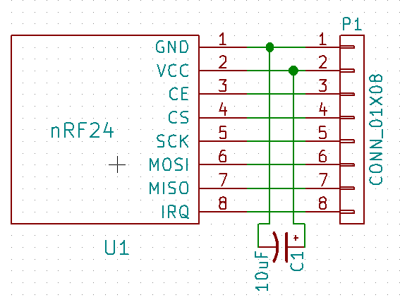
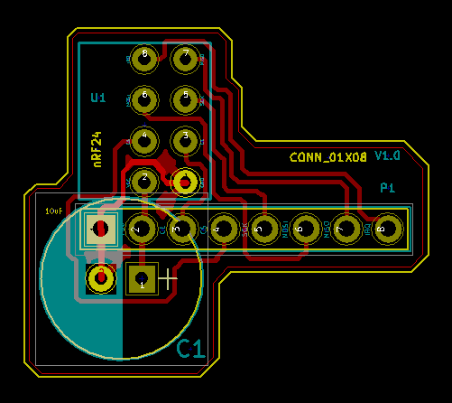
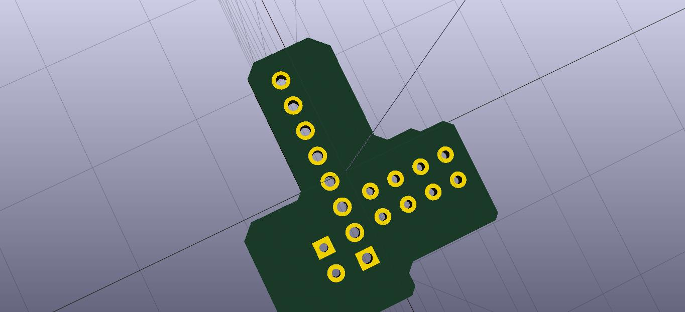

# nRF24L01 Breakout Board (Printed Circuit Board)
#### Disclaimer: For education purpose only. You may use or modify this design for any commercial purpose at your own risk.

This utility board will help you connect an nRF24L01 module (with 2x4 output pins) via a breadboard.

## Details

### nRF24L01 module:

### PCB Layout of nRF24L01 module:

You can find my created schematic and footprints for the 2x4 pins of nRF24L01 module under [library](library) directory which I used to design the final prototype of the breakout board.

### Breakout Board Schematic

### Printed Circuit Board (PCB) of the Breakout Board

### 3D Front View of the PCB

### 3D Back View of the PCB

Notes: I have added all KiCAD files along with the gerber files for quick modification and manufacturing of the PCB.
